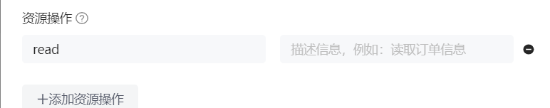

# authing-spring-boot-starter


> Authing 快速实现任何 Web、App 和企业软件的身份认证和用户管理，为你的客户和员工提供完善的登录解决方案。
> 本项目可以为您提供拦截校验 token 的功能。

您可以新建一个您的 spring-boot 工程来使用本项目，或直接使用我们在 `/example/use-this-starter` 提供的示例项目进行试用。

## 1 添加依赖

### 1.1 从中央仓库引入

在您的 Spring 项目中引入：

```xml
<dependency>
    <groupId>cn.authing</groupId>
    <artifact>authing-spring-boot-starter</artifact>
    <version>{latest-version}</version>
</dependency>
```

### 1.2 以 jitpack 方式从 github 源码引入：

添加 repository,

```xml
 <repositories>
    <repository>
      <id>jitpack.io</id>
      <url>https://jitpack.io</url>
    </repository>
  </repositories>
```

添加 dependency,

```xml
<dependency>
  <groupId>com.github.Authing</groupId>
  <artifactId>authing-spring-boot-starter</artifactId>
  <version>{authing.version}</version>
</dependency>
```

`authing.version` 为 github 最新 tag.

以上两种引用方式二选一。

> 由于 okhttp3 的版本冲突问题，请从您的 `spring-boot-starter-web`中排除 `okhttp`, 使用 `okhttp:4.8.0`版本。

```xml
<dependency>
  <groupId>org.springframework.boot</groupId>
  <artifactId>spring-boot-starter-web</artifactId>
  <exclusions>
    <exclusion>
      <groupId>com.squareup.okhttp3</groupId>
      <artifactId>okhttp</artifactId>
    </exclusion>
  </exclusions>
</dependency>
<dependency>
  <groupId>com.squareup.okhttp3</groupId>
  <artifactId>okhttp</artifactId>
  <version>4.8.0</version>
</dependency>
```


## 2 配置
### 2.1 配置用户池与应用

这里以 `yml`格式为例。 在 `application.yml` 配置文件中添加您的用户池与应用的相关配置：

```yml
authing:
  user-pool:
    user-pool-id: AUTHING_USERPOOL_ID
    secret: AUTHING_USERPOOL_SECRET

  app:
    app-id: APP_ID
    app-host: APP_HOST
```

- `authing.user-pool.user-pool-id`：用户池 ID。
- `authing.user-pool.secret`：用户池密钥。
- `authing.app.app-id`：应用ID。
- `authing.app.app-host`：应用域名，格式为 `https://YOUR_DOMAIN.authing.cn`

> 你可以在此[了解如何获取 UserPoolId](https://docs.authing.cn/v2/guides/faqs/get-userpool-id-and-secret.html), 在控制台的**应用**中查看自己的应用列表。

### 2.2 配置授权规则
#### 2.2.1 需要校验登录态


默认情况下，所有资源都为受保护资源，需要特定用户拥有特定权限才可访问。

参考这里[对用户进行权限管理](https://docs.authing.cn/v2/guides/access-control/) 创建相应的`资源`以及`授权`。

注意，资源操作请填 'read'，目前仅支持 read 操作。



#### 2.2.2 不需要校验登录态

如果您希望暴露某些资源，如注册页/ 登录页等，来允许未登录者访问，请将资源地址配置在 `application.yml`中：
```yaml
authing:
  exclude-paths:
    - /demo0/url0
    - /demo1/url1
```
`authing.exclude-paths`: 不需要校验的 url 白名单列表。

## 3 失败处理

如果您希望全局地给验证失败的请求返回特定异常，如 HTTP 403 异常，可在您的全局异常处理器中添加以下内容：

```java
@ControllerAdvice(basePackages = "YOUR-PACKAGE")
@ResponseBody
@Slf4j
public class GlobalExceptionHandler {
    @ExceptionHandler(AuthingException.class)
    public ResponseResult handleAuthingException(AuthingException e) {
        log.error("log:*token error{},exception class:{}",e.getMessage(),e.getClass());
        return ResponseVO.fail(403,"wrong token");
    }
}
```

## 4 开始使用

进行功能测试。
### 4.1 受保护的资源
对于受保护的资源：

```java
@RestController
public class DemoController {
  @GetMapping("/test/resources")
  public ResponseVO getResource() {
    return ResponseVO.success().setMessage("some resource need authorization");
  }
}
```

携带正确的 token:

```http
GET /product/attr/info/<attrId> HTTP/1.1
Host: localhost:8080
User-Agent: apifox/1.0.0 (https://www.apifox.cn)
Authorization: YOUR TOKEN
```

响应结果：

```json
{
    "code":200,
    "message":"some resource need authorization"
}
```

不携带 token 或携带错误的 token :

```http
GET /product/attr/info/<attrId> HTTP/1.1
Host: localhost:8080
User-Agent: apifox/1.0.0 (https://www.apifox.cn)
Authorization: WRONG TOKEN
```

响应结果：

```json
{
    "code":403,
    "message":"wrong token"
}
```
### 4.2 不受保护的资源

```http
GET /product/attr/info/<attrId> HTTP/1.1
Host: localhost:8080
User-Agent: apifox/1.0.0 (https://www.apifox.cn)
Authorization: NO TOKEN
```
```json
{
    "code":200,
    "message":"ok"
}
```
